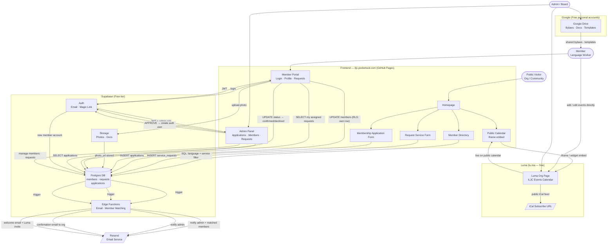

# ILJC — Backend Architecture Decision & Data Flow

## 1. Requirements

| Requirement | Detail |
|---|---|
| Member authentication | Workers log in to manage their own profile and events |
| Self-service directory | Members edit their own languages, services, bio, photo |
| Member-editable calendar | Members post/edit their own availability and events |
| Public search | Visitors filter by language, service type, location |
| Service request intake | Organizations submit requests; routed to matched members |
| Membership application | New workers apply to join the cooperative |
| Email notifications | Booking confirmations, application status, event reminders |
| Admin / governance | Board manages member accounts, reviews applications |
| Scale | ~50 members, ~200–500 events/year, ~100 service requests/year |
| Values | Open-source preferred; no vendor lock-in; low cost |

---

## 2. Backend Comparison

| Criteria | Airtable | Supabase | Headless CMS | Firebase | **Google Workspace** |
|---|---|---|---|---|---|
| **Built-in auth** | ❌ None | ✅ Full (email, magic link, OAuth) | ❌ None | ✅ Full | ⚠️ Google accounts only |
| **Member self-service portal** | ⚠️ Forms only | ✅ RLS per member | ❌ No | ✅ Yes | ⚠️ AppScript web app required |
| **Calendar** | ⚠️ Admin view | ✅ Custom + real-time | ❌ No | ✅ Custom | ✅ Google Calendar — best-in-class (but replaced by Luma) |
| **Complex queries / directory** | ⚠️ Limited | ✅ Full SQL | ❌ No | ⚠️ NoSQL | ⚠️ Sheets API; limited filtering |
| **File / photo storage** | ⚠️ Attachments | ✅ S3-compatible | ⚠️ CDN only | ✅ Yes | ✅ Google Drive |
| **Email / automation** | ⚠️ Paid | ✅ Edge Functions | ❌ No | ✅ Yes | ✅ AppScript + Gmail |
| **Real-time updates** | ❌ No | ✅ Yes | ❌ No | ✅ Yes | ⚠️ Sheets polling; Calendar is real-time |
| **Open source / self-hostable** | ❌ No | ✅ Yes | ❌ No | ❌ Google lock-in | ❌ Google lock-in |
| **Cost** | $20/user | Free → $25/mo | Limited free | Free tier | $6/user/mo (no nonprofit discount for LLCs) |
| **Coop values alignment** | ❌ Poor | ✅ Strong | ⚠️ Neutral | ❌ Google dep. | ⚠️ Familiar but proprietary |
| **Non-dev usability** | ✅ High | ⚠️ Medium | ✅ High | ⚠️ Medium | ✅ Very high |
| **Dev complexity** | Low | Medium | Low | Medium | Low–Medium |

---

## 3. Google Workspace Evaluation

### What Google Workspace Offers

| Tool | ILJC Use Case | Verdict |
|---|---|---|
| **Google Calendar** | Member-editable shared calendar; public embed; iCal subscribe | ✅ Excellent — best-in-class |
| **Google Forms** | Service request intake; membership applications | ✅ Works well; no dev required |
| **Google Sheets** | Member directory "database"; request tracking | ⚠️ Workable but not queryable from website |
| **Google Drive** | Member photos, translated documents | ✅ Good; familiar to everyone |
| **Gmail + AppScript** | Email notifications; automated workflows | ✅ Solid for basic automation |
| **AppScript Web Apps** | Custom member portal UI on top of Sheets | ⚠️ Possible but significant dev effort |
| **Google Meet** | Virtual interpretation delivery | ✅ Already familiar to many |
| **Google Workspace Admin** | User account management for the coop | ✅ Good for managing member accounts |

### Where Google Workspace Wins

**Calendar is genuinely superior to a custom-built solution.** Members likely already use Google Calendar. Key advantages:
- Members add/edit events in a UI they already know — zero training
- Per-member calendars that roll up into one public "ILJC Calendar"
- Built-in iCal subscribe link — any calendar app works
- Public Google Calendar embeds directly into the ILJC website
- Color-coded by member or service type out of the box
- Mobile app included — no custom PWA needed

**Non-technical operations.** A Google Form submission drops into a Sheet automatically. An admin can see all service requests, application responses, and member info in familiar spreadsheets. AppScript can send Gmail notifications with zero infrastructure.

**Cost can be near-zero.** If even one member already has Google Workspace (or gets a personal business account), shared drives and calendars can be set up for the group. However, ILJC is an LLC — **it does not qualify for Google Workspace for Nonprofits (free).** Standard pricing is $6/user/month; if only 2–3 admins need accounts, that's $12–18/month.

### Where Google Workspace Falls Short

**No real member portal.** Google Workspace has no native way for a member to visit `iljc.pocketsod.com/portal`, log in, and see a profile page with their own data. The closest options are:
1. Give members direct Sheets access (messy, error-prone, exposes all rows)
2. Build an AppScript web app (custom UI over Sheets — doable, but similar dev effort to Supabase with worse scalability)
3. Use Google Forms for self-updates (no validation, no live profile view)

**Sheets is not a searchable database.** The public directory search ("find interpreters who speak Burmese and do medical work") cannot be powered by a Google Sheet efficiently. It requires either fetching the whole sheet client-side and filtering in JS (works at small scale, fragile) or the Sheets API (rate-limited, slow).

**Google lock-in.** Everything lives in Google's ecosystem. If the coop switches tools, migrating Calendar, Drive, Forms, and Sheets data is painful. This conflicts with the cooperative's data sovereignty values.

**AppScript has hard limits.** Scripts time out at 6 minutes; 20 triggers/user; 100 email recipients/day on free. For ILJC's current scale these are fine, but they're ceilings, not floors.

### Google Workspace Verdict

> **Don't use Google Workspace as the primary backend, but do use Google Calendar for the events layer.**
>
> The calendar is where Google wins decisively. Everything else — member auth, directory, request routing — is better served by Supabase.

---

## 4. Decision: Supabase + Luma (Hybrid) ✅

### Final Architecture

| Layer | Tool | Why |
|---|---|---|
| **Auth + member portal** | Supabase Auth + RLS | Only tool with built-in per-member access control |
| **Member directory** | Supabase Postgres | Full SQL search; scales cleanly |
| **Service requests** | Supabase + Edge Functions | Structured intake → email → member routing |
| **Membership applications** | Supabase table | Same pipeline as requests; admin review flow |
| **Calendar — events** | **Luma (lu.ma)** | Beautiful embed, free, RSVP built-in, no Google dependency |
| **File storage** | Supabase Storage | Member photos; docs; linked from profiles |
| **Email** | Resend (via Supabase Edge Functions) | 3,000 free/month; transactional |
| **Documents / shared files** | Google Drive | Bylaws, templates, meeting notes — familiar and free |

### Why the Hybrid Wins

1. **Luma eliminates the hardest frontend to build.** A custom calendar UI with event creation, RSVP, and discovery is weeks of development. Luma replaces it with zero code — embed the public calendar with one `<iframe>` or script tag.

2. **Luma looks better than Google Calendar's embed.** Google Calendar's iframe is dated and nearly impossible to style. Luma renders a clean, modern event grid or agenda that matches a professional cooperative brand.

3. **RSVP and attendance tracking are built in.** Luma gives each event its own page with registration, attendee list, and reminders — no custom dev needed.

4. **No Google dependency.** This aligns with the cooperative's data sovereignty values. Members don't need Google accounts to manage events.

5. **Supabase still owns the member identity and directory.** When an org searches for a Burmese interpreter, that query hits Postgres. When a member logs in, Supabase Auth controls access. Luma is a view and discovery layer, not the source of truth for member data.

### Revised Cost

| Service | Cost |
|---|---|
| Supabase | **Free** (scales to $25/month if needed) |
| Luma | **Free** (free org account; unlimited events and RSVPs) |
| Resend (email) | **Free** up to 3,000 emails/month |
| GitHub Pages (hosting) | **Free** |
| **Total** | **$0/month to start** |

---

## 5. Database Schema

```sql
-- Lookup tables
create table languages (
  id   serial primary key,
  name text not null unique,  -- "Spanish", "Burmese", "Arabic" ...
  code text                   -- ISO 639-1 where applicable
);

create table service_types (
  id   serial primary key,
  name text not null unique   -- "Interpretation", "Translation", "Training" ...
);

-- Core member record (public-facing fields)
create table members (
  id              uuid primary key references auth.users on delete cascade,
  full_name       text not null,
  display_name    text,
  bio             text,
  photo_url       text,
  location        text,               -- neighborhood / city area
  website         text,
  is_active       boolean default true,
  is_public       boolean default true,
  joined_at       timestamptz default now(),
  updated_at      timestamptz default now()
);

-- Many-to-many: member ↔ language
create table member_languages (
  member_id   uuid references members(id) on delete cascade,
  language_id int  references languages(id),
  proficiency text check (proficiency in ('native','fluent','professional')),
  primary key (member_id, language_id)
);

-- Many-to-many: member ↔ service type
create table member_services (
  member_id       uuid references members(id) on delete cascade,
  service_type_id int  references service_types(id),
  primary key (member_id, service_type_id)
);

-- Calendar events (member-posted availability or services)
create table events (
  id              uuid primary key default gen_random_uuid(),
  member_id       uuid references members(id) on delete cascade,
  title           text not null,
  description     text,
  event_type      text,               -- "availability", "training", "community", "service"
  location        text,
  is_virtual      boolean default false,
  starts_at       timestamptz not null,
  ends_at         timestamptz,
  is_all_day      boolean default false,
  price           numeric(8,2),
  max_attendees   int,
  is_public       boolean default true,
  created_at      timestamptz default now()
);

-- Incoming service requests from organizations
create table service_requests (
  id                  uuid primary key default gen_random_uuid(),
  org_name            text not null,
  contact_name        text not null,
  contact_email       text not null,
  contact_phone       text,
  service_type_id     int  references service_types(id),
  language_id         int  references languages(id),
  requested_date      date,
  requested_time      text,
  duration_hours      numeric(4,1),
  location            text,
  is_virtual          boolean default false,
  notes               text,
  status              text default 'pending'
                        check (status in ('pending','matched','confirmed','completed','cancelled')),
  assigned_member_id  uuid references members(id),
  created_at          timestamptz default now()
);

-- Membership applications
create table applications (
  id              uuid primary key default gen_random_uuid(),
  full_name       text not null,
  email           text not null,
  phone           text,
  languages       text[],             -- free-text until approved
  services        text[],
  statement       text,               -- "why do you want to join?"
  resume_url      text,
  status          text default 'pending'
                    check (status in ('pending','reviewing','approved','declined')),
  reviewed_by     uuid references members(id),
  reviewed_at     timestamptz,
  notes           text,
  created_at      timestamptz default now()
);

-- Row-level security policies
alter table members          enable row level security;
alter table events           enable row level security;
alter table service_requests enable row level security;

-- Members can read all public profiles; update only their own
create policy "public members visible"   on members for select using (is_public = true);
create policy "members update own row"   on members for update using (auth.uid() = id);

-- Events: public can read public events; members manage their own
create policy "public events visible"    on events for select using (is_public = true);
create policy "members insert own events" on events for insert with check (auth.uid() = member_id);
create policy "members update own events" on events for update using (auth.uid() = member_id);
create policy "members delete own events" on events for delete using (auth.uid() = member_id);

-- Service requests: only admins and assigned member can see details
create policy "assigned member sees request"
  on service_requests for select
  using (auth.uid() = assigned_member_id or auth.role() = 'service_role');
```

---

## 6. Data Flow Diagram



---

## 7. Integration Architecture

```
GitHub Pages (static)
  └── index.html, services.html, directory.html, about.html
  └── calendar.html         ← embeds Luma widget; no custom backend
  └── member-portal/        ← vanilla JS or lightweight framework; talks to Supabase
        └── login.html
        └── profile.html
        └── my-events.html  ← links out to Luma org page for event management
        └── requests.html

Supabase (hosted, free tier)
  └── Auth            → member login / session management
  └── Postgres DB     → members, service_requests, applications
  │                      (events table not needed — Luma handles this)
  └── Row-Level Sec.  → members can only touch their own rows
  └── Storage         → member photos, translated docs
  └── Edge Functions  → email triggers, member matching algorithm

Luma (lu.ma — free org account)
  └── One ILJC org page with public event calendar
  └── Each event gets its own Luma page with RSVP
  └── Embeddable calendar widget → calendar.html on the site
  └── Public iCal URL → any calendar app can subscribe
  └── Admins/co-hosts add events via Luma dashboard (zero dev)
  └── Attendees RSVP without needing a Luma account

Google Drive (free)
  └── Bylaws, governance docs, meeting minutes
  └── Translated materials, templates

Email (Resend — free tier: 3,000 emails/month)
  └── New service request → admin + matched members
  └── Application received → admin
  └── Application approved → welcome email + link to Luma org page
  └── Booking confirmed → org contact
```

---

## 8. Implementation Phases

### Phase 1 — Static + Forms (no auth yet)
- Service request form → Supabase table → admin email via Edge Function
- Membership application form → Supabase table → admin email
- **Public calendar: embed Luma widget** — admin creates ILJC org on lu.ma, adds upcoming events, embeds calendar widget on site (zero dev)
- Public directory from Supabase `members` table (admin-populated for now)
- Google Drive folder set up for shared governance docs

### Phase 2 — Member Portal
- Supabase Auth for member login
- Members edit their own profile (name, bio, languages, services, photo)
- Members post/edit their own events
- Members view and respond to service requests assigned to them

### Phase 3 — Admin Panel + Governance
- Application review flow (approve → auto-creates member account)
- Member management dashboard
- Basic reporting (requests volume, languages served, member activity)

### Phase 4 — Advanced
- Automated member matching algorithm (language + service + availability scoring)
- Booking calendar with conflict detection
- iCal export / subscribe link for public calendar
- Language selector / translated UI
- Member earnings tracking and payout records
